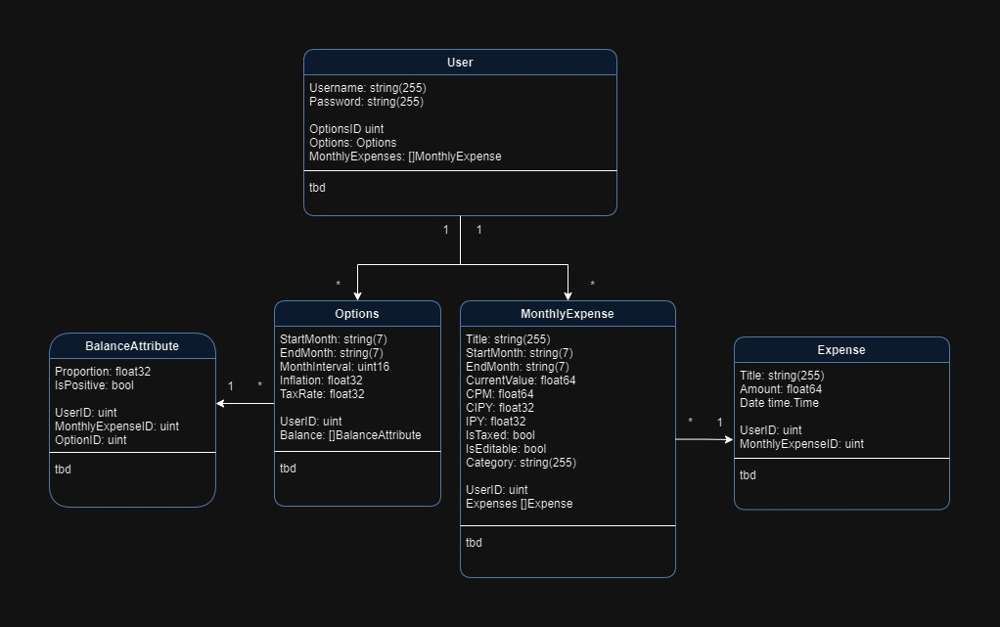

# fin-planning-backend

## UML Diagram


## PostgreSQL DB
You will need to create a `.env.local` file in the main directory of the repo. Paste the following inside, and change your credentials.

```
POSTGRES_USER=<user>
POSTGRES_PASSWORD=<password>
POSTGRES_DB=<db_name>
POSTGRES_HOSTNAME=<address>
POSTGRES_PORT=<port>

```